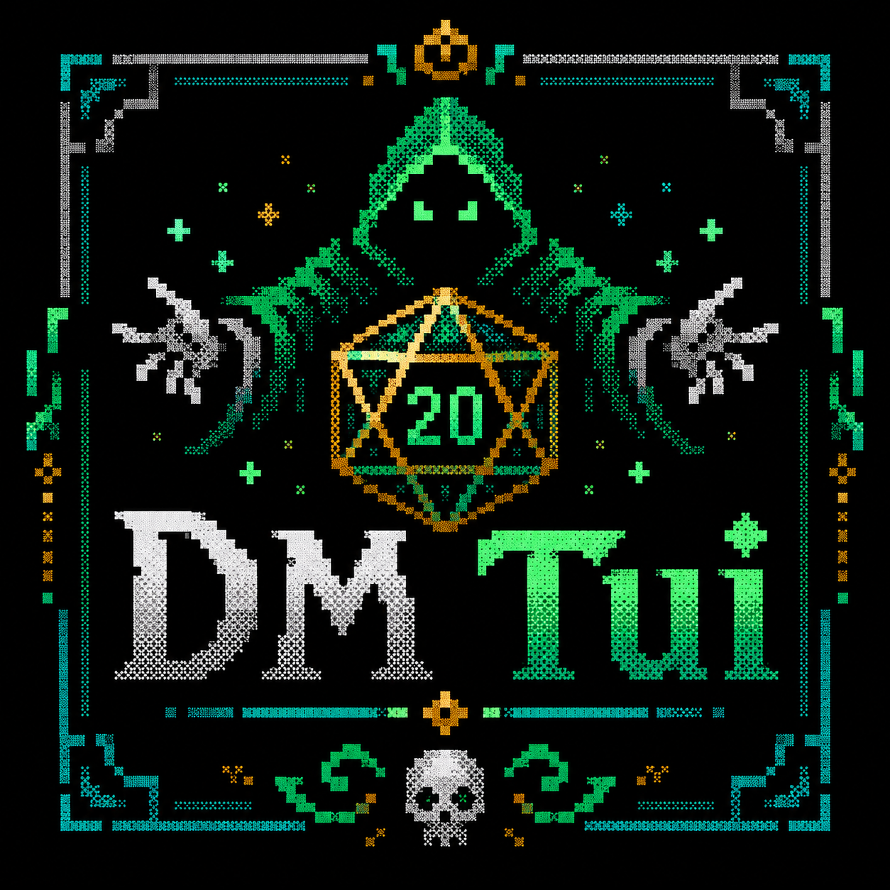

# Ward



**Ward is a private, table-side control surface for running an in-person D&D game.**

It keeps the volatile stuff close at hand — initiative, HP, conditions, creature
positions, the soundtrack, and campaign continuity — so the DM can keep the
story moving instead of juggling paperwork. Ward helps at the table; it doesn't
try to simulate the game. The DM's rulings and the physical table stay
authoritative.

Built with [Textual](https://textual.textualize.io/), keyboard-first, and free
software under the GPL-3.0.

## What it does

- **Combat tracking** — initiative, HP, AC, conditions, and attacks with the
  dice engine built in. Arrow keys, one letter per action, undo/redo.
- **Battle map** — a token map that stays glanceable as the terminal shrinks.
  Spatial notes only: no range, terrain, or line-of-sight math.
- **Monsters & spells** — hand-written templates plus the official 5e SRD
  (via [Open5e](https://open5e.com)), searchable and dropped in as full
  statblocks.
- **Campaign continuity** — parties, notes, and every played encounter persist
  automatically. Ten fights can stay open at once, paused and resumed
  independently.
- **DM screens** — a fixed 5e quick-reference and a live Party Reference
  (HP, AC, passives, save DCs) at a keypress.
- **Soundtrack** — stream an ambient station or pull suggested
  [Tabletop Audio](https://tabletopaudio.com) tracks for the current scene.
- **AI when you want it** — `/` answers rules questions; `Ctrl+G` proposes a
  monster lineup. Purely optional, off unless you configure a key.

Ward is organized around three moments: **Resume** an ongoing fight, **Run**
what tonight needs, or **Prepare** a campaign and its future encounters. On a
fresh install it offers campaign setup, a ready-to-run sample encounter, or a
blank fight.

## Install

Requires Python 3.11+.

```sh
git clone https://github.com/interurban/DMTui.git
cd DMTui
python -m venv .venv
.venv/bin/pip install -e .
ward
```

Or install straight from Git without cloning:

```sh
python -m venv .venv
.venv/bin/pip install git+https://github.com/interurban/DMTui.git
ward
```

Run `ward` (or `python -m ward`). The older `dmtui` command still works as a
compatibility alias.

Soundtrack playback needs **mpv** or **ffplay** on your PATH. Everything else
works offline out of the box.

## Optional AI assistant

Ward is fully usable without an API key — the `/roll` dice commands and all
game features are local. To turn on `/` Ask AI and `Ctrl+G` encounter
suggestions:

```sh
cp .env.example .env
```

Then put your key in `.env`:

```env
OPENAI_API_KEY=sk-your-key-here
```

`.env` is gitignored and loaded automatically at startup. You can export the
same key in your shell instead.

## Learning the app

Ward is keyboard-first. Press `?` in the app for the full guide.

- [Using Ward](docs/USING.md) — every key, music configuration, D&D Beyond
  imports, and how attacks and spells are rolled.
- [Developing Ward](docs/DEVELOPING.md) — tests, code layout, and the
  packaged-entry-point design.
- [CHANGELOG.md](CHANGELOG.md) — sprint log · [REVIEW.md](REVIEW.md) — review
  findings and fixes · [ROADMAP.md](ROADMAP.md) — priorities and non-goals.

## Data & privacy

All Ward state — campaigns, parties, notes, and played encounters — is saved as
local JSON beside the app and ignored by Git. Use **Ward data** in the campaign
folio (`Ctrl+O`) to export portable backups. Ward never uploads anything except
the optional AI queries, and it makes no network calls at all when
`WARD_OFFLINE=1` is set.

## License

Ward is free software released under the
[GNU General Public License v3](LICENSE).